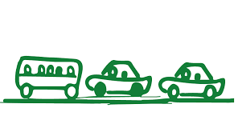

```{r setup, echo=FALSE, results='hide', message=FALSE, warning=FALSE}
# Če želimo nastaviti pisave v PDF-ju, odkomentiramo
# in sledimo navodilom v programu.
#source("fontconfig.r", encoding="UTF-8")

# Uvoz vseh potrebnih knjižnic
source("lib/libraries.r", encoding="UTF-8")
```

```{r rstudio, echo=FALSE, results='asis'}
# Izris povezave do RStudia na Binderju
source("lib/rstudio.r", encoding="UTF-8")
```





***

# Izbira teme

V svoji projektni nalogi bom analiziral različne načine transporta tako ljudi kot tudi blaga v Sloveniji. 

Raziskal bom s katero vrsto prevoza se ljudje največ prevažajo in kako se le-to spreminja skozi leta. Primerjal bom spremembo v količini cestnih vozil glede na regije v daljšem časovnem obdobju, hkrati pa me bo zanimalo tudi, kako narašča število osebnih avtomobilov na alternativne vire goriva v zadnjih letih. Prav tako bom poskušal poiskati povezavo med povprečno starostjo avtomobila in povprečno bruto plačo po regijah in pogledal kako se plače in povprečna starost spreminjata skozi daljši časovni razpon. 
Zanimala me bo tudi primerjava števila umrlih v prometnih nesrečah preko različnih vrst transporta in preko različnih regij. S pomočjo analize podatkov bom poiskal povezave med številom potnikov in številom nesreč, glede na posamezne vrste transporta. 

Glavni cilji moje analize bodo, da bi ugotovil, kako se različne vrste transporta, število umrlih, povprečno število avtomobilov in njihova povprečna starost spreminjajo skozi leta. Spremembe bom večinoma ponazoril tudi glede na slovenske regije. Hkrati bom trende spreminjanja poskušal razložiti s poenostavljeno razlago. 


***

# Obdelava, uvoz in čiščenje podatkov

```{r uvoz, echo=FALSE, message=FALSE, warning=FALSE}
source("uvoz/uvoz.r", encoding="UTF-8")
```
Uporabil sem podatke, ki sem jih pridobil na spletnih strani Statističnega urada Republike Slovenije. Podatki večinoma obsegajo obdobje od leta 2001 do leta 2017.
Podatke sem najprej shranil kot CSV datoteke, nato pa jih uredil in jih zbral v več razpredelnicah v obliki *tidy data*.

Tabela 1 (promet: Število potnikov v posamezni vrsti prevoza):

- `Vrsta_prevoza` - spremenljivka: prevozno sredstvo
- `Leto` - spremenljivka: leto
- `Potniki` - meritev: število potnikov v 1000

Tabela 2 (pogon: Število avtomobilov glede na vrsto pogona):

- `Vrsta_pogona` - spremenljivka: Vrsta pogona avtomobila   
- `Leto` - spremenljivka: leto
- `Stevilo_avtomobilov` - meritev: število avtomobilov v prometu 

Tabela 3 (umrli: Število umrlih v cestnoprometnih nesrečah na 10.000 prebivalcev po regijah):

- `Regija` - spremenljivka: regija
- `Leto` - spremenljivka: leto
- `Umrli` - meritev: število umrlih na 10.000 prebivalcev

Tabela 4 (avtomobili: Število osebnih avtomobilov na 1000 prebivalcev po regijah):

- `Regija` - spremenljivka: regija
- `Leto` - spremenljivka: leto
- `Avtomobili` - meritev: število avtomobilov na 1000 prebivalcev

Tabela 5 (starost: Povprečna starost osebnega avtomobila po regijah):

- `Regija` - spremenljivka: regija
- `Leto` - spremenljivka: leto
- `Umrli` - meritev: povprečna starost avtomobila


***

# Analiza in vizualizacija podatkov

```{r vizualizacija, echo=FALSE, message=FALSE, warning=FALSE, results='hide'}
source("vizualizacija/vizualizacija.r", encoding="UTF-8")
```

```{r graf_promet, echo=FALSE, fig.align='center', message=FALSE, paged.print=TRUE, fig.cap='Graf 1', warning=FALSE}
graf_promet
```

Iz grafa je razvidno, da se največ potnikov prevaža s cestnim javnim linijskim prevozom.
Okrog leta 2004 opazimo upad uporabe cestnega javnega linijskega prevoza. Možen razlog za to so ugodne
družbene razmere  v tistem obdobju, saj so si ljudje lahko privoščili lasten avtomobil.
Pri ostalih vrstah prevoza je število potnikov skozi leta precej konstantno.
To bi lahko razložili s tem, da so te vrste prevoza večinoma namenjene transportu blaga, vendar 
sama tehnologija se na teh področjih ni veliko napredovala.


```{r graf_starost, echo=FALSE, message=FALSE, fig.align='center',  fig.cap='Graf 2'} 
graf_starost
```

Iz grafa lahko ugotovimo, da povprečna starost osebnega avtomobila skozi leta narašča po vseh regijah.
Po posamezni regiji je povprečen avtomobil star med 7 in 10 let.


```{r graf_umrli1, echo=FALSE, message=FALSE, fig.align='center', fig.cap='Graf 3'} 
graf_umrli1
```

Graf nam prikazuje število umrlih v nesrečah med leti 2001 in 2017 po posameznih regijah. Opazimo lahko trend, da v večini regij število smrti v cestnoprometnih nesrečah upada. Kot razlog lahko navedemo varnejše avtomobile in ceste.


```{r graf_vrsta_pogona, echo=FALSE, message=FALSE, fig.align='center', warning=FALSE, fig.cap='Graf 4'} 
graf_vrsta_pogona
```


Ob pogledu na graf lahko hitro ugotovimo, katere vrste pogona spadajo med alternativne in s tem najbolj 
obetavne v prihodnosti. Število električnih avtomobilov v Sloveniji se je leta 2015 več kot podvojilo,
tudi v prihodnjih letih pa ta delež najhitreje narašča. Med alternativne vrste pogona prištevamo tudi hibride,
kateri so v Sloveniji vse bolj popularni, predvsem v mestnih okrožjih. Njihovo število strmo narašča in lahko pričakujemo, da bodo v prihodnjih 10 letih prevzeli vodilno mesto med avtomobili. 
Prav tako se je v preteklih letih marsikdo odločil predelati svoj avtomobil na plin. 
Sam menim, da je prihodnost v elektriki, saj je z dokončnim prebojem na trg avtomobilov, ta vrsta pogona že precej razširjena in vse bolj dostopna ter priljubljena med vozniki.


```{r zemljevid_placa, echo=FALSE, message=FALSE, fig.align='center',  fig.cap='Zemljevid 1'} 
zemljevid_placa
```


Iz zemljevida opazimo, da so najvišje plače v osrednji Sloveniji, kar je tudi pričakovano.


```{r zemljevid_starost, echo=FALSE, message=FALSE, fig.align='center', fig.cap='Zemljevid 2'} 
zemljevid_starost
```


Na zemljevidu opazimo, da je povprečna starost avtomobila najnižja v osrednji Sloveniji. 
To bi lahko razložili, s pomočjo zemljevida o bruto plačah. Zaradi višjih plač v osrednjem delu Slovenije,
si lahko tamkajšnji prebivalci privoščijo tudi novejše avtomobile. 

`cor(starost2015$Starost_avtomobila, placa2015$Placa) = -0.5062193`

Korelacija med starostjo avtomobila in povprečno plačo je negativna in precej visoka, kar pomeni, da imajo ljudje z višjimi plačami novejše avtomobile in obratno.


*** 

# Napredna analiza podatkov

```{r analiza, echo=FALSE, message=FALSE}
source("analiza/analiza.r", encoding="UTF-8")
```

```{r graf_regresija_umrli, echo=FALSE, message=FALSE, fig.align='center',  fig.cap='Graf 5'} 
graf_regresija_umrli
```

Z regresijsko premico lahko ponazorimo, da število smrti v prometu z leti upada. 
Možen razlog za to so boljši avtomobili, ki so tudi tehnološko bolj napredni.
Opremljeni so z veliko varnostnimi sistemi, ki nam pomgajo v nevarnih situacijah v prometu in s tem preprečijo marsikatero nesrečo.

```{r graf_regresija_avti, echo=FALSE, message=FALSE, fig.align='center',  fig.cap='Graf 6'} 
graf_regresija_avti
```


Število osebnih avtomobilov skozi leta narašča. Razlog za to lahko iščemo v miselnosti sedanje družbe, saj je avtomobil za marsikoga nujno prevozno sredstvo, po drugi strani pa tudi statusni simbol. 
Avtomobil nam ponuja tudi svobodo gibanja, saj lahko potujemo kamor in kdaj želimo. 


```{r zemljevid_cluster_umrli, echo=FALSE, message=FALSE, fig.align='center',  fig.cap='Zemljevid 3', warning=FALSE} 
zemljevid_cluster_umrli 
```

Zemljevid nam predstavlja regije, razvrščene glede na število umrlih v cestnoprometnih nesrečah med leti 2001 in 2017. Iz zemljevida lahko vidimo, da je najmanj nesreč v zasavski regiji, največ pa v primorsko-notranjski. 


***
# Shiny


```{r shiny, echo=FALSE}
shinyAppDir("shiny", options=list(width="100%", height=600))
```


# Zaključek

Pri izdelavi projektne naloge sem ugotovil precej novih dejstev o tansportu v Sloveniji. 
Ugotovil sem, da smo Slovenci v preteklosti precej več uporabljali javni promet, vendar pa se ta delež v zadnjih letih ponovno dviguje. Zelo zanimivo se mi zdi, da povprečna starost osebnega avtomobila skozi celotno obdobje narašča. V povprečju ima že vsak drug Slovenec lasten avtomobil. Kljub vse večji uporabi transporta, število prometnih nesreč ne narašča in je v večini regij celo nižje kot v preteklosti. Za to je večinoma zaslužna nova tehnologija, s katero so avtomobili postali varnejši. 
Prav tako sem potrdil svoje domneve o hitrem razvoju novih, alternativnih vrst pogona, pri čemer prevladuje električen in hibridni pogon. 
Potrdil sem tudi hipotezo, da imajo ljudje z višjimi plačami novejše avtomobile. 
Z regresijo sem skušal napovedati trende v prihodnosti. Trend večanja števila osebnih avtomobilov na prebivalca naj bi se še nadaljeval, prav tako pričakujem, da bodo prihodnji avtomobili še varnejši.
Z vse večjo stopnjo avtonomne vožnje pa se bo verjetno število umrlih v cestnoprometnih nesrečah še zmanjšalo.


